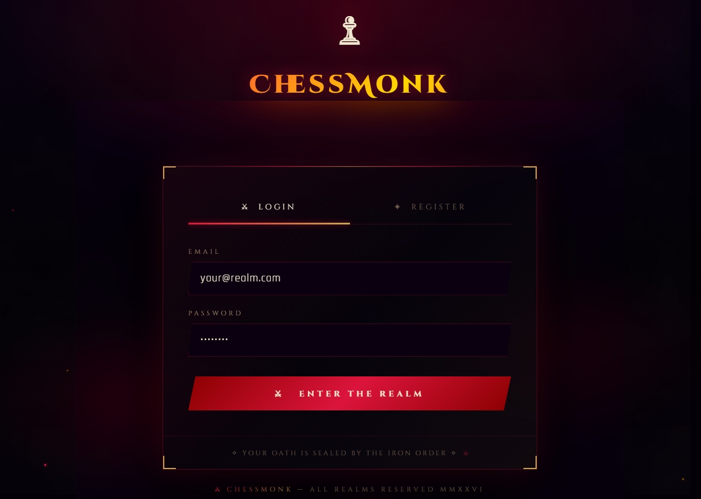
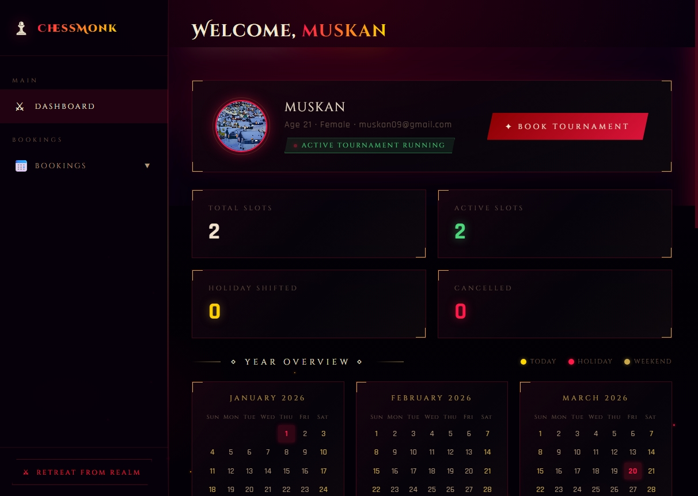
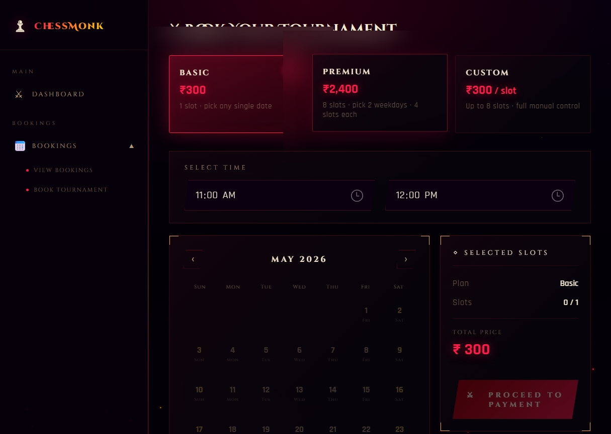
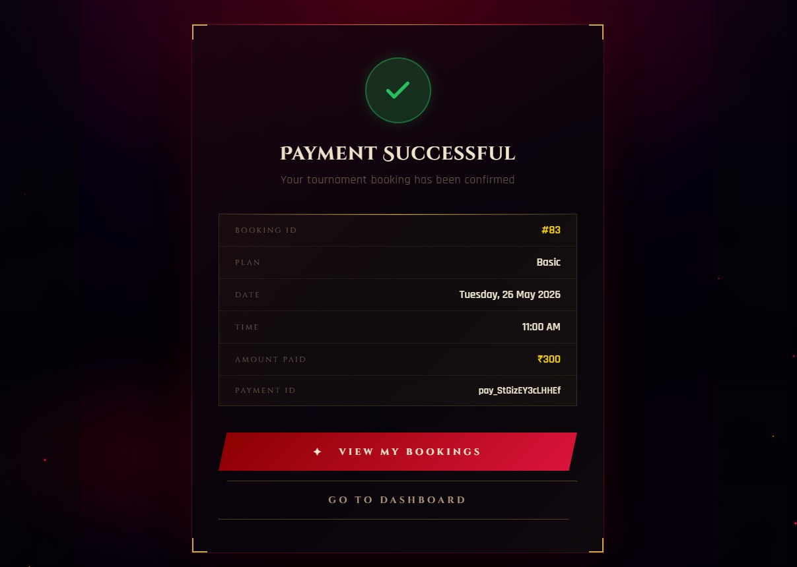
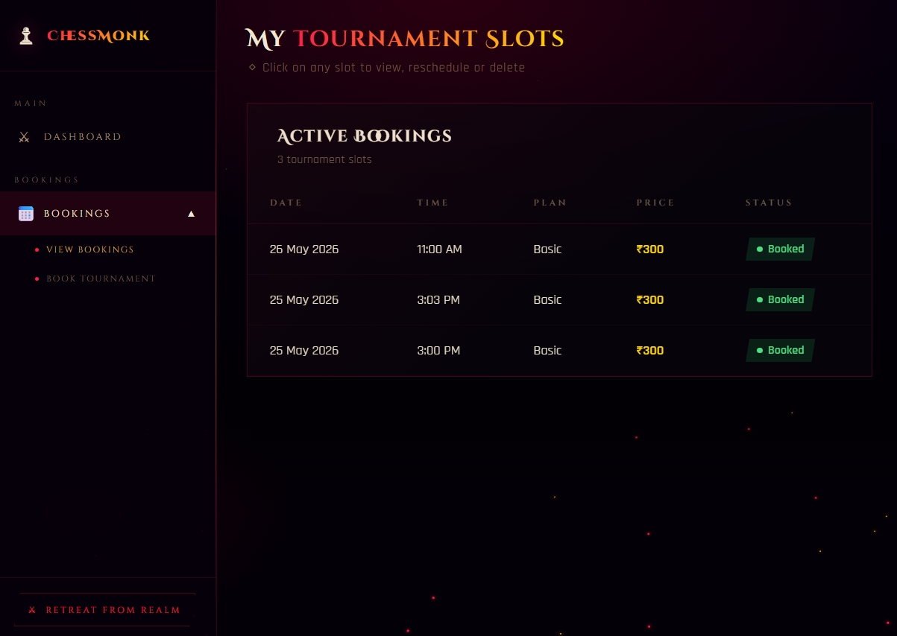

# ♟ ChessMonk — Tournament Booking Platform

<div align="center">


**A full-stack chess tournament booking system — built from scratch.**

</div>

---

## 🎯 What is ChessMonk?

ChessMonk is a full-stack web application that lets users register, log in, and book chess tournament slots. It handles three distinct booking plans, Razorpay payment integration, Indian holiday conflict detection, and a complete booking lifecycle — all wrapped in a medieval-cyberpunk themed UI.

---

## ✨ Features

### 🔐 Authentication
- JWT-based login and registration (access + refresh token pattern)
- Custom Django user model with extended profile fields
- Password hashing via Django's PBKDF2
- Protected routes — unauthorized users redirected automatically
- Profile picture upload stored in cloud-style media folder

### 📅 Booking System (3 Plans)
| Plan | Slots | Price | Logic |
|------|-------|-------|-------|
| **Basic** | 1 | ₹300 | User picks any single date |
| **Monthly Premium** | 8 | ₹2400 | User picks 2 weekdays → system auto-generates 4 dates each |
| **Custom** | Up to 8 | ₹300/slot | Full manual date selection |

### 🗓️ Holiday Intelligence
- Indian public holidays baked in (2025–2026)
- Holidays blocked on booking calendar with tooltip
- Auto-slot generation for Premium plan skips holidays automatically
- Holiday warning popup when rescheduling to a holiday date

### 💳 Payments
- Razorpay integration with server-side order creation
- Payment signature verified on backend before confirming booking
- Custom payment receipt UI (not Razorpay's default success screen)
- Two-button post-payment navigation — user decides where to go

### 📋 Booking Management
- View all bookings in a clean table
- Reschedule any slot with holiday conflict detection
- 2-hour gap rule — same user cannot book same date within 2 hours of an existing slot
- Delete slot with confirmation popup
- Soft delete pattern — booking history preserved

### 📊 Dashboard
- Live stats: Total Slots / Active / Rescheduled / Cancelled — loaded from API
- Year calendar with holidays, weekends, and today highlighted
- Profile card with avatar, age, gender

---

## 🛠️ Tech Stack

| Layer | Technology |
|-------|------------|
| Backend | Django 4.x + Django REST Framework |
| Authentication | djangorestframework-simplejwt |
| Database | SQLite (dev) |
| Payments | Razorpay |
| CORS | django-cors-headers |
| Image Uploads | Pillow |
| Frontend | HTML + CSS + Vanilla JavaScript |
| Fonts | Google Fonts — Cinzel Decorative + Rajdhani |

---

## 🗂️ Project Structure

```
chessmonk/
├── chessmonk/              # Django project settings
│   ├── settings.py
│   ├── urls.py
│   └── wsgi.py
├── core/                   # Auth app (users, registration, login)
│   ├── models.py
│   ├── serializers.py
│   ├── views.py
│   └── urls.py
├── bookings/               # Bookings app
│   ├── models.py
│   ├── serializers.py
│   ├── views.py
│   └── urls.py
├── frontend/
│   └── assets/
│       ├── index.html
│       ├── dashboard.html
│       ├── book-tournament.html
│       ├── payment-success.html
│       └── view-bookings.html
├── screenshots/
│   ├── login.jpeg
│   ├── dashboard.jpeg
│   ├── booking.jpeg
│   ├── receipt.jpeg
│   └── bookings.jpeg
├── media/
└── manage.py
```

---

## 🚀 Getting Started

### Prerequisites
- Python 3.10+
- pip

### Installation

```bash
git clone https://github.com/Muskanlol/chessMonk_django.git
cd chessMonk_django

python -m venv venv
venv\Scripts\activate

pip install django djangorestframework djangorestframework-simplejwt django-cors-headers Pillow razorpay

python manage.py makemigrations
python manage.py migrate

python manage.py runserver
```

Open `frontend/assets/index.html` with **Live Server** in VS Code.

> Make sure Django is running at `http://127.0.0.1:8000` before using the frontend.

---

## 🔗 API Endpoints

### Auth
```
POST   /api/users/register/
POST   /api/users/login/
GET    /api/users/profile/
```

### Bookings
```
GET    /api/bookings/
POST   /api/bookings/
DELETE /api/bookings/<id>/
PATCH  /api/bookings/<id>/reschedule/
POST   /api/bookings/confirm-payment/
```

---

## 🔒 Security Highlights

- Passwords hashed with PBKDF2
- JWT access tokens expire in 60 minutes
- Refresh tokens last 7 days
- Razorpay payment amount always calculated server-side
- Payment signature verified using HMAC-SHA256 before confirming booking
- 2-hour booking gap enforced server-side — cannot be bypassed from frontend

---

## 📸 Screenshots

| Login | Dashboard |
|-------|-----------|
|  |  |

| Book Tournament | Payment Receipt |
|-----------------|-----------------|
|  |  |

| View Bookings |
|---------------|
|  |

---

## 🧠 Key Design Decisions

**Why JWT over Sessions?**
JWT is stateless — the server doesn't need to store session data. Scales better and works with a future mobile app without any backend changes.

**Why Decoupled Architecture?**
Django serves only JSON. The frontend is plain HTML/JS. Same backend API can power a mobile app in the future.

**Why soft delete for bookings?**
Hard deleting removes history. Soft delete (status flag) preserves the audit trail for disputes and record keeping.

**Why server-side payment verification?**
Razorpay sends a signature after payment. We verify it on the backend using HMAC-SHA256 before marking the booking as confirmed. This prevents anyone from faking a successful payment.

**Why 2-hour booking gap?**
Prevents users from double-booking the same slot or booking sessions too close together — enforced both on frontend (instant feedback) and backend (cannot be bypassed).

---

## 👩‍💻 Author

Built with ♟ by **Muskan Nag**

- GitHub: [@Muskanlol](https://github.com/Muskanlol)

---

## 📄 License

This project is open source and available under the [MIT License](LICENSE).

---

<div align="center">
  <sub>Master the Board. Rule the Realm. ⚔</sub>
</div>
